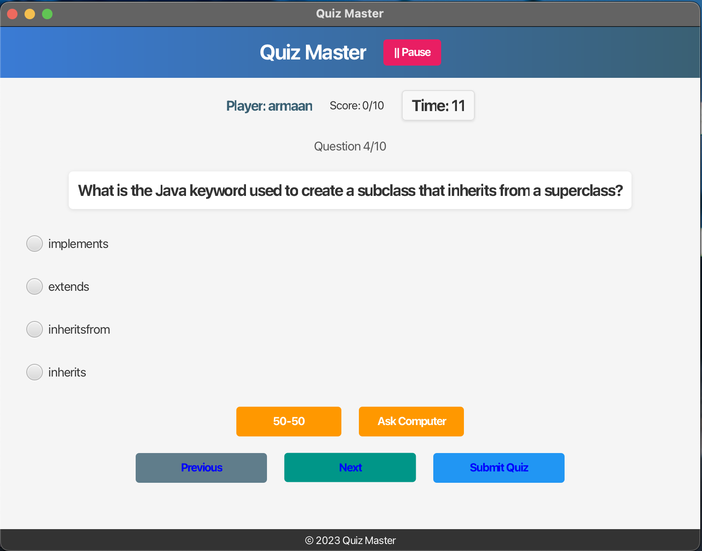

# Quiz Master - Java Quiz Application

A feature-rich interactive quiz application built with JavaFX that allows users to test their knowledge across various categories.

## Screenshots





## Features

### For Players
- **Multiple Quiz Categories**: Choose from various knowledge domains
- **Customizable Quiz Length**: Select 5, 10, 15, or 20 questions per quiz
- **Interactive UI**: Modern, responsive user interface with intuitive controls
- **Timed Questions**: Each question has a 20-second timer to add excitement
- **Lifelines**:
  - 50:50 - Removes two incorrect options
  - Ask Computer - AI assistance with 80% accuracy
- **Progress Tracking**: See your score and remaining questions at all times
- **Detailed Results**: Review your answers with correct solutions at the end
- **Global Leaderboard**: Compare your performance with other players
- **Keyboard Shortcuts**: Quickly navigate and answer using keyboard controls

### For Administrators
- **Admin Panel**: Secure administrative interface
- **Question Management**: Add, edit, and delete questions
- **Category Management**: Create and organize question categories
- **Difficulty Settings**: Set difficulty levels for questions

## Technologies Used

- **Java 21**: Core programming language
- **JavaFX 21**: UI framework
- **FXML**: UI layout design
- **CSS**: UI styling
- **Maven**: Dependency management and build tool
- **Firebase Realtime Database**: Cloud storage for questions and leaderboard

## Setup Instructions

### Prerequisites
- Java Development Kit (JDK) 21 or newer
- Maven 3.6.0 or newer

### Installation

1. **Clone the repository**
   ```bash
   git clone https://github.com/yourusername/Quiz-Game-in-Java.git
   cd Quiz-Game-in-Java
   ```

2. **Firebase Setup**
   - Create a Firebase project at [Firebase Console](https://console.firebase.google.com/)
   - Set up a Realtime Database
   - Create a `config.properties` file in the `src/main/resources/` directory with the following structure:
     ```properties
     # Firebase Configuration
     firebase.database.url=https://your-project-id.firebaseio.com/
     firebase.auth.key=your-auth-key
     ```
     Note: This file is in `.gitignore` and needs to be created manually as it contains sensitive information.
   - Import the provided database backup:
     1. Navigate to your Firebase Realtime Database console
     2. Click the three dots menu (⋮) and select "Import JSON"
     3. Browse and select the `backup/DB_export.json` file from your project folder
     4. Click "Import" to populate your database
   - Set up database rules:
     1. In the Firebase console, go to the "Rules" tab
     2. Copy the content from `backup/rules.txt` in the project
     3. Paste into the rules editor and click "Publish"

3. **Build the application**
   ```bash
   mvn clean package
   ```

4. **Run the application**
   ```bash
   java -jar target/quizmaster-0.0.1-SNAPSHOT.jar
   ```

   Alternatively, use Maven to run:
   ```bash
   mvn javafx:run
   ```

## Using the Application

### Starting a Quiz
1. Enter your name
2. Select a category
3. Choose the number of questions
4. Click "Start Quiz" or press "S" key

### Answering Questions
- Select an option by clicking or using number keys 1-4
- Navigate between questions using Next/Previous buttons or arrow keys
- Use lifelines when needed by clicking the buttons or using assigned keyboard shortcuts

### Keyboard Shortcuts

| Key | Function |
|-----|----------|
| S | Start Quiz / Submit Quiz |
| I | Show Instructions |
| 1-4 | Select answer options |
| Enter/Right Arrow | Next question |
| Backspace/Left Arrow | Previous question |
| F | 50:50 Lifeline |
| A | Ask Computer Lifeline |
| P | Pause game |
| Esc | Close dialog / Pause / Resume |
| Ctrl+E | Exit game |
| H | Show keyboard shortcuts help |
| N | New Quiz (on results screen) |

### Admin Access
1. Click the "Admin" button on the start screen
2. Enter administrator credentials
3. Use the admin panel to manage questions and categories

## Project Structure

```
Quiz-Game-in-Java/
├── src/
│   ├── main/
│   │   ├── java/
│   │   │   └── org/main/quiz/
│   │   │       ├── AdminPanel.java
│   │   │       ├── Controller.java
│   │   │       ├── Firebase.java
│   │   │       ├── KeyboardShortcutsHelper.java
│   │   │       ├── LeaderboardEntry.java
│   │   │       ├── Main.java
│   │   │       └── Question.java
│   │   ├── resources/
│   │   │   ├── config.properties
│   │   │   └── org/main/quiz/
│   │   │       ├── styles.css
│   │   │       ├── quiz.fxml
│   │   │       └── config.properties
│   │   └── backup/
│   │       ├── DB_export.json
│   │       └── rules.txt
│   │   └── module-info.java
├── pom.xml
└── README.md
```

## Customization

### Styling
You can customize the appearance by modifying the CSS file located at:
```
src/main/resources/org/main/quiz/styles.css
```
## License

This project is licensed under the MIT License - see the LICENSE file for details.